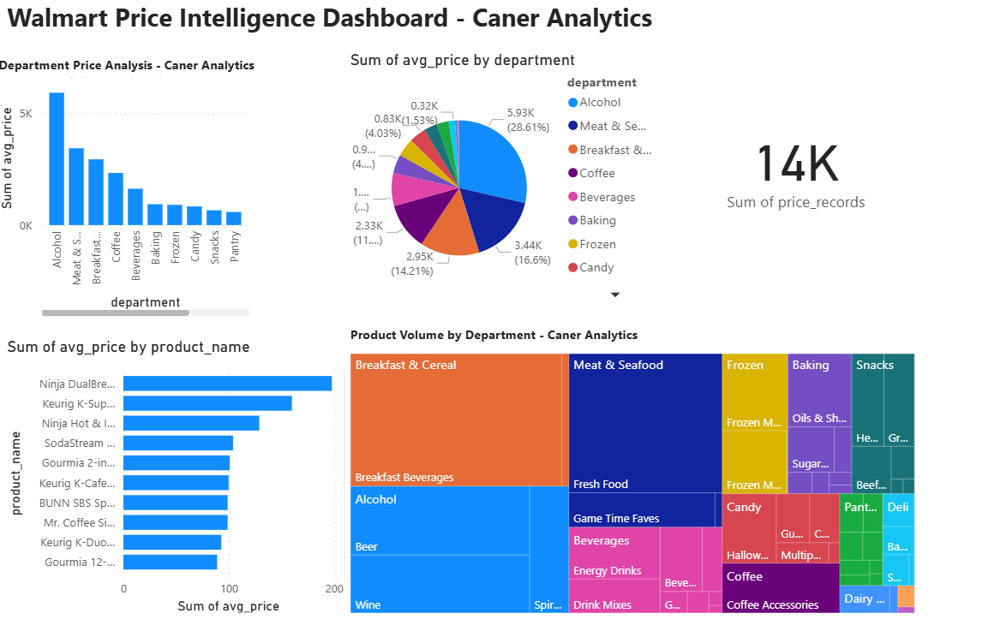

# Walmart Price Intelligence - Caner Analytics
Enterprise-scale retail price intelligence system analyzing 335,000+ Walmart grocery price records to identify pricing patterns and business opportunities.

## Technical Achievement
- **Built Django REST API** processing 335,351 Walmart price records across 30,827 unique products
- **Designed PostgreSQL database schema** with proper relationships for large-scale retail data
- **Created interactive Power BI dashboard** with 5 visualization types for executive insights
- **Implemented data pipeline** processing 335k+ records with error handling and validation

## Business Impact
- **Identified Alcohol category** commanding 28.6% of total price volume - key high-margin focus area
- **Discovered Coffee accessories** averaging $17.29 vs $3.16 grocery staples (5x premium pricing)
- **Analyzed 14 department price hierarchies** enabling data-driven pricing strategy decisions
- **Built scalable intelligence platform** ready for real-time price monitoring expansion

## Key Insights
- **Premium Coffee equipment** drives highest individual product prices (Ninja: $198, Keurig systems: $90-160)
- **Alcohol + Meat & Seafood** represent major revenue categories with substantial volume
- **Price volatility analysis** revealed products with 10x price swings for monitoring alerts
- **Department ranking** from Coffee ($17.29 avg) to Pantry ($3.16 avg) shows clear margin tiers

## Dashboard Features
- Department price analysis with trend visualization
- Product-level pricing intelligence and rankings
- Executive KPI cards showing data scale and insights
- Interactive filtering and drill-down capabilities
- **Cross-visual filtering**: Click any chart element to filter all other visualizations
- **Dynamic treemap analysis**: Department portfolio breakdown with real-time updates
  

## Technology Stack
- **Backend**: Django REST Framework, PostgreSQL
- **Data Processing**: Python, Pandas, SQL
- **Visualization**: Power BI Desktop
- **Database**: PostgreSQL with custom views and optimized queries
